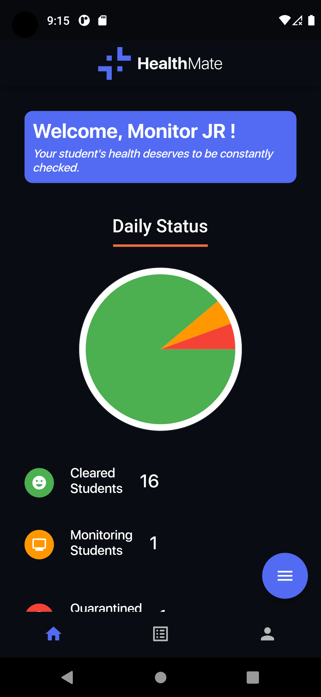

# About the Project

## Built With
   

## Project Name 
 - HealthMate

## Project Description
 - This project called HealthMate is a mobile application designed to facilitate health monitoring and management for students and employees of the University of the Philippines Los Baños (UPLB). The application aims to ensure the well-being and safety of the UPLB community by providing a convenient and efficient platform for health tracking, symptom reporting, and contact tracing.

- The system consists of three main user views: User's View, Admin's View, and Entrance Monitor's View. Each view caters to specific roles and responsibilities within the UPLB community.

### User's View:

- In the User's View, individuals can sign in or sign up to create an account. They can securely authenticate and access features such as:

- Sign In/Sign Up: Users can authenticate themselves using their credentials or create a new account to access the system.

- Personal Information: Users can provide their name, username, college, course, and student number during the sign-up process.

- Pre-existing Illness: Users must declare any pre-existing illnesses they may have, such as hypertension, diabetes, tuberculosis, cancer, kidney disease, cardiac disease, autoimmune disease, asthma, or allergies.

- Homepage: Users can view a list of their health entries and check whether they are quarantined or not.

- My Profile: Users can access their personal profile, including a QR code for their building pass. The QR code is generated daily and cannot be generated if the user is quarantined, experiencing symptoms, or has no health entry.

- Add Today's Entry: Users can input their health status for the day, including any symptoms they may be experiencing. If the user has symptoms from a predefined list (such as fever, cough, sore throat, etc.), they will not be allowed entry, and the QR code will not be generated.

- Edit/Delete Today's Entry: Users can edit or delete their health entry, but the changes must be approved by the admin.

### Admin's View:
- The Admin's View is accessible to authorized administrators and provides additional functionalities, including:

- Sign In/Sign Up: Admins can authenticate themselves using their credentials or create a new account with appropriate permissions.

- View and Manage Students: Admins can view all students' health records and apply filters based on date, course, college, or student number. They can also add students to quarantine, remove students from quarantine, and move students to monitoring.

- Approve/Reject Requests: Admins can approve or reject delete/edit requests made by students for their health entries.

- Elevate User Type: Admins can elevate user types from default users to admin/monitor status.

### Entrance Monitor's View:
- The Entrance Monitor's View is specifically designed for entrance monitors and includes the following features:

- Sign In/Sign Up: Entrance monitors can authenticate themselves using their credentials or create a new account with appropriate permissions.

- Search Student Logs: Entrance monitors can search for specific student logs and view the details of students who entered.

- Read Generated QR: Entrance monitors can scan and read the generated QR codes to verify entry permissions.

- Update Logs: Entrance monitors can update student logs by recording their location, student number, and status (cleared, under monitoring, under quarantine).

Overall, the HealthMate aims to streamline health monitoring processes, ensure compliance with health protocols, and provide an effective tool for contact tracing within the UPLB community. By implementing this system, UPLB can enhance the safety and well-being of its students and employees, enabling a healthier environment for learning and work.

### Table of Contents
- [Features](#features)
- [Tech Stack](#tech-stack)
- [Starting the Project](#starting-the-project)
- [Credits](#credits)
- [Authors](#authors)

## Features (with screenshots)
<figure align = >
 
<h1>UserView</h1>

### UserDashboard

<figcaption >This is the User Dashboard wherein students would be redirected to after login. This contains the buttons for add entry, edit entry and delete entry. User can also see if they are under monitoring or under quarantine </figcaption>
 

### User Add Entry

 
 <figcaption >This would add an entry today for the user. They can check all the symptoms that they are currently experiencing and also click a yes or no if they have a close contact </figcaption>
 

### User Edit Entry
 

 <figcaption >This would send an entry edit request to the monitoring officer along with their edited valued, they are also asked to input remarks why they want to edit and will be approved or rejected by the monitor</figcaption>
 

 ### DeleteEntry 
 

  <figcaption >This would delete the entry of the user according to their input and will send an edit request to monitor. They must include remarks on why they want their entry to be deleted.</figcaption>
  

 ### Generated Qr
 

  <figcaption >This is generated only when the user who generated an entry has no close contact</figcaption>
  

### **List Of Entries**  
 

  <figcaption >This is where the list of entries of the user will show. The data shown is the date where they added an entry, whether they have a close contact for that day or not , and if they have any symptoms</figcaption>
  
 
 <h1>Monitor View</h1>

 ### MonitorLogin

  
 
  <figcaption >The monitor has a seperate login page which redirects them to the monitoring dashboard</figcaption>
  

### Monitor DashBoard

 
  <figcaption >This is the monitor dashboard which contains the daily status of entries. The current monitor would be able to see the  cleared, monitoring and quarantined students for today</figcaption>
 
 
### Monitor Logs

 
  <figcaption >This is the monitor logs which gets the current list of scanned qr code by entrance monitor. Monitors can search by student name to easily find the student. Monitors can also edit the logs</figcaption>
  

### Monitor Profile

 
  <figcaption >The Monitor Profile contains the current location of the monitor student number, their name, college wherein they can also update their location and this is where they can sign up.</figcaption>
  

### Monitor QrScan

 
  <figcaption >This scans the students qr code and would be added to the list of the logs. When they scan it would get the id of the entry, it would then be checked on the database if it was generated today, if it's not it's an invalid qr</figcaption>
  

### Monitor User View

 
  <figcaption >Monitors can also go the user dashboard and can add, edit or delete an entry. Basically what the functionalities the user has, the monitor has also</figcaption>
  

 ### Admin View

 ### Admin Dashboard
 

 
  <figcaption >This is the User Dashboard wherein students would be redirected to after login. This contains the buttons for add entry, edit entry and delete entry. User can also see if they are under monitoring or under quarantine </figcaption>
  

 ### Admin Login
 

 
  <figcaption >This is the Admin Dashboard wherein the admin would be redirected to after login. They would be able to see the daily status for cleared, monitoring and quarantined students all are which are represented in the pie chart. </figcaption>
  

 ### Admin Profile
 

 
  <figcaption >This is the admin profile wherein it contains the the profile of the current admin. It shows all their necessary details and such. This is also where they can Sign out</figcaption>
  

 ### Entry Requests
 

 
  <figcaption >This contains the entry edit requests of students, admins has the power whether they would reject or approve edit request of students after reading their remarks. </figcaption>
  

 ### Delete Requests
 

 
  <figcaption >This contains the entry delete requests of students, admins has the power whether they would reject or approve delete request of students after reading their remarks.  </figcaption>
  

</figure>

## Tech Stack
  ### Flutter (Front End)
  Flutter is a cross-platform framework developed by Google for building native-like applications for iOS, Android, and the web from a single codebase. Flutter provides a rich set of UI components and a reactive framework that enables fast and expressive UI development. It allows for seamless integration with Firebase and provides an efficient and performant user interface for the UPLB Health Monitoring System.
  ### Firebase (Back End)
  Firebase is a comprehensive mobile and web application development platform provided by Google. It offers a wide range of services and tools that simplify the development process, including authentication, real-time database, cloud storage, cloud functions, and hosting. Firebase's real-time database and cloud storage are utilized to store and manage user data, health records, and other relevant information for the UPLB Health Monitoring System. Firebase's authentication service is used for user authentication and security.
  ### Android
  Android is a popular operating system developed by Google for mobile devices. It offers a user-friendly interface, a vast selection of applications, and extensive customization options. With its open-source nature, Android has a thriving community of developers constantly contributing to its growth.

# Starting the Project
  1. Build the apk using `flutter build apk`
  2. Install the built apk on your device

# Credits
  - Flutter doc
  - Flutter pub.dev

# Authors
  - John Robertson Despi
  - Jonah Perez
  - Diana Compahinay
  - Joseph Ryan Pena